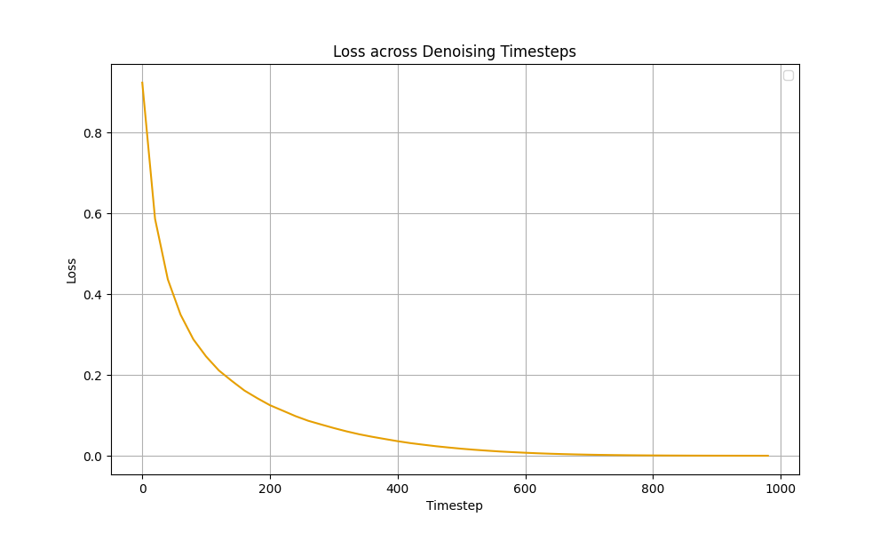

## Baseline Results

<table>
<thead>
<tr>
<th style="text-align:center">Context Length</th>
<th style="text-align:center">Method</th>
<th style="text-align:center">Memory Budget</th>
<th style="text-align:center">0-16</th>
<th style="text-align:center">16-48</th>
<th style="text-align:center">overall</th>
</tr>
</thead>
<tbody>
<tr>
<td style="text-align:center">48</td>
<td style="text-align:left">Prepending Memory + Memory Compression (Ours)</td>
<td style="text-align:center">16</td>
<td style="text-align:center">0.36</td>
<td style="text-align:center">0.25</td>
<td style="text-align:center">0.31</td>
</tr>
<tr>
<td style="text-align:center">48</td>
<td style="text-align:left">FIFO Diffusion [1]</td>
<td style="text-align:center">16</td>
<td style="text-align:center">0.12</td>
<td style="text-align:center">0.03</td>
<td style="text-align:center">0.075</td>
</tr>
<tr>
<td style="text-align:center">48</td>
<td style="text-align:left">Outpainting</td>
<td style="text-align:center">16</td>
<td style="text-align:center">0.10</td>
<td style="text-align:center">0.02</td>
<td style="text-align:center">0.06</td>
</tr>
<tr>
<td style="text-align:center">48</td>
<td style="text-align:left">Prepend Memory + Last 16 Frames [2]</td>
<td style="text-align:center">16</td>
<td style="text-align:center">0.47</td>
<td style="text-align:center">0.00</td>
<td style="text-align:center">0.235</td>
</tr>
<tr>
<td style="text-align:center">48</td>
<td style="text-align:left">Prepend Memory + Last 32 Frames with 1 Frame Skip [2]</td>
<td style="text-align:center">16</td>
<td style="text-align:center">0.23</td>
<td style="text-align:center">0.15</td>
<td style="text-align:center">0.19</td>
</tr>
<tr>
<td style="text-align:center">48</td>
<td style="text-align:left">GameNGen [3]</td>
<td style="text-align:center">16</td>
<td style="text-align:center">0.14</td>
<td style="text-align:center">0.00</td>
<td style="text-align:center">0.07</td>
</tr>
</tbody>
</table>

<b>Table 1. Baseline Results across Multiple Frame Conditioning Strategies. </b>Context Length refers to the number of raw frames used as prior observations (i.e., memory). By default, we use a default Context Length of 48 frames, along with an additional 16 frames for generating the output—except for GameNGen, which generates one frame at a time. To ensure a fair comparison, we constrain all methods to a memory budget of 16 frames. Accordingly, we either sample 16 frames from the 48-frame context or compress the 32 context frames into an equivalent number of tokens corresponding to 16 frames. 

 
[1] Jihwan Kim, Junoh Kang, Jinyoung Choi, Bohyung Han. FIFO-Diffusion: Generating Infinite Videos from Text without Training. NeurIPS 2024
 
[2] William Harvey, Saeid Naderiparizi, Vaden Masrani, Christian Weilbach, Frank Wood. Flexible Diffusion Modeling of Long Videos. NeurIPS 2022
 
[3] Dani Valevski, Yaniv Leviathan, Moab Arar, Shlomi Fruchter. Diffusion Models Are Real-Time Game Engines, 2024

## Insights from Error Term Decompositions

<b>Fig 1. Error Term Decomposition of Pretrained Model. </b>We calculate the MSE loss across different timesteps of the pretrained models. The loss is accumulated across the entire MSR-VTT dataset and reported as the average loss.

 

<b>Fig 2. Error Accumulation using Different Timestep Scheduling. </b>

 

This demonstrates the error accumulation of OpenSoraPlan+FIFO with different time steps schedulers. We consider the schedule that is $\text{Uniform}([0,999^{\alpha}] )^{1/\alpha}$. Here we set $\alpha$ as $1/2$ (order 2) and $1/3$ (order 3). The ``reverse'' refers to the schedule that is $999 - \text{Uniform}([0,999^{\alpha}] )^{1/\alpha}$. For more details of scheduling, please refer to Fig. 3.

<b>Fig 3. Visualization of Polynomial & Reverse-Polynomial Scheduling. </b>

 

## More Visualizations

### Successful Cases from Minecraft

<b>Fig 3. Minecraft Demo. </b>The left frames represent the expected ground truth, while the right frames, outlined with a red square, are generated by the model. 

### Raw Videos from Minecraft

  <video width="48%" controls>
    <source src="assets/minecraft_demos/minecraft_success_minerlbasaltbuildvillagehouse_v0_20016.mp4" type="video/mp4">
  </video>
  <video width="48%" controls>
    <source src="assets/minecraft_demos/minecraft_success_minerlbasaltbuildvillagehouse_v0_20051.mp4" type="video/mp4">
  </video>

<b>Fig 4. Raw Videos from Minecraft. </b>The left frames represent the expected ground truth, while the right frames, outlined with a red square, are generated by the model. The leading frames without red squares are provided context. We guarantee that the generated frames are part of the ground truth, thus the generated frames are not hallucinated. 

## Proposition 1

For any random variables $X,Y,Z$ supported on $\Omega$ and measurable functions $f,g,h:\Omega\rightarrow\Omega$ such that $g(x) = h(f(x))$ for all $x\in\Omega$, we have that $I(X;Z| Y, f(X))\leq I(X;Z| Y,g(X))$.

Proof:

We first decompose $I(X,f(X),g(X);Z|Y)$ in two ways as follows.

$I(X,f(X),g(X);Z|Y) = I(f(X);Z|Y)+I(X;Z|Y,f(X))+I(g(X);Z|Y,f(X),X) = I(f(X);Z|Y)+I(X;Z|Y,f(X)),$

where the first equality results from the chain rule, and the second equality results from the fact that $I(g(X);Z|Y,f(X),X)=0$. Similarly, we have that

$I(X,f(X),g(X);Z|Y) = I(g(X);Z|Y)+I(X;Z|Y,g(X)).$

Thus, we have that

$I(X;Z|Y,g(X)) - I(X;Z|Y,f(X)) = I(f(X);Z|Y) - I(g(X);Z|Y).$

In the following, we will show that the right-hand side of this equation is non-negative. In fact, the chain rule shows that

$I(g(X),f(X);Z|Y)= I(g(X);Z|Y)+I(f(X);Z|Y,g(X)).$

Similarly, we have that

$I(g(X),f(X);Z|Y)= I(f(X);Z|Y)+I(g(X);Z|Y,f(X))=I(f(X);Z|Y),$

where the last equality results from that $g(x)=h(f(x))$ for all $x$. Thus, we have that

$I(f(X);Z|Y) - I(g(X);Z|Y)=I(f(X);Z|Y,g(X))\geq 0.$
